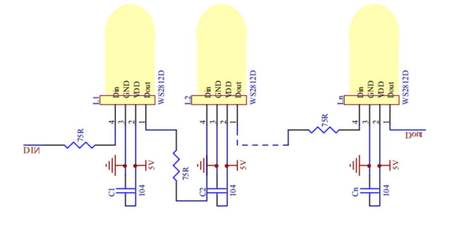
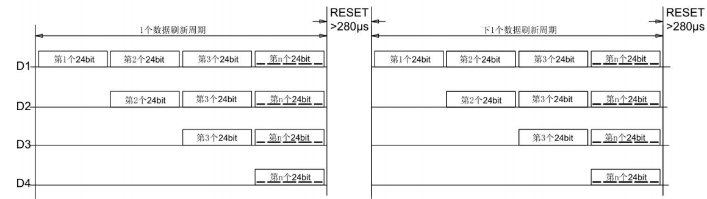
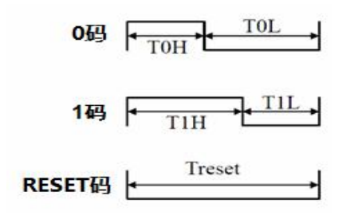

# WS2812

## 数据手册

WS2812 是由 Worldsemi 开发的 Digial RGB LED，内部集成了控制芯片，数据手册可以在官网 [Worldsemi](http://www.world-semi.com/solution/list-4-1.html) 上下载。

WS2812 有多种型号，它们的控制芯片、封装尺寸、外部引脚有所不同。目前淘宝上常见的有：

|型号|长宽高（mm）|
|----|----|
|0807|1.9×1.6×0.8|
|2020|2.2×2.0×0.84|
|3535|3.68×3.48×1.95|
|5050|5.4×5.0×1.6|

如果是自行焊接，建议选择3535或5050。以上四种的引脚功能是一样的：

|引脚|功能|
|---|---|
|VDD|电源（5或12V）|
|GND|地|
|Din|数据输入|
|Dout|数据输出|

多个 WS2812 共享同一个电源，同时串联 Din/Dout。

> 本节后面的内容摘自 [幻彩灯带 WS2812 驱动-TuyaOS-涂鸦开发者](https://developer.tuya.com/cn/docs/iot-device-dev/Symphony_lights_with_WS2812_driving_WiFi?id=Kawttinrc1pmx)



WS2812 芯片采用 **单线归零码** 的通讯方式，芯片在上电复位以后，Din端接收从控制器传输过来的数据。

1. 首先送过来的 24 bit 数据被第一个芯片提取后，送到芯片内部的数据锁存器。
2. 剩余的数据经过内部整形处理电路整形放大后，通过 Dout 端口开始转发输入给下一个级联的芯片，每经过一个芯片的传输，信号减少 24 bit。

芯片采用自动整形转发技术，使得该芯片的级联个数不受信号传送的限制，仅仅受限信号传输速度要求。

1. 芯片内部的数据锁存器根据接受到的 24 bit 数据，在 OUTR、OUTG、OUTB 控制端产生不同的占空比控制信号。
2. 等待 Din 端输入 RESET 信号时，所有的芯片同步将接收到的数据送到各个段，芯片将在该信号结束后重新接受的数据。
3. 在接收开始的 24 bit 数据后，通过 Dout 口转发数据口。

芯片在没有接收到 RESET 码前，OUTR、OUTG、OUTB 管教原输出保持不变，当接受到 280 μs 以上的低电平 RESET 码后，芯片将刚刚接收到的 24 bit PWM 数据脉宽输出到 OUTR、OUTG、OUTB 引脚上。



其中 D1 为 MCU 端发送的数据，D2、D3、D4 为级联电路自动整形转发的数据。控制器可以连续发送 24 bit 的 RGB 控制信号，第一个灯珠截取前 24 bit 后，会显示在自己的 LED 上，并将其余的数据进行整形后发送给第二颗灯珠。第二颗灯珠会截取第二组 24 bit 数据进行显示，并继续进行转发剩下的，直到最后一组数据被显示为止。

WS2812的逻辑 1、0、reset 码如下图所示：



|数据组成|含义|时长|
|----|----|----|
|T0H|0码，高电平时间|220ns~380ns|
|T1H|1码，高电平时间|580ns~1.6µs|
|T0L|0码，低电平时间|580ns~1.6µs|
|T1L|1码，低电平时间|220ns~420ns|
|Treset|帧单位，低电平时间|280µs以上|

> 文章 [ws2812驱动总结（包括对时序的详细分析，代码基于STC15系列单片机）](https://blog.csdn.net/u013062709/article/details/85217281) 中指出不同的 WS2812 高低电平的时间可能不一样，具体还要看所购买的型号的手册。为了方便计算，后面假设T0H=0.4u，T1H=0.8u，T0L=0.8u，T1L=0.4u，Treset>50us.

24 bit 数据结构如下所示：

```raw
R7 R6 R5 R4 R3 R2 R1 R0 G7 G6 G5 G4 G3 G2 G1 G0 B7 B6 B5 B4 B3 B2 B1 B0
```

数据发送的顺序是高位先发，并按照 RGB 的顺序发送。

WS2812通过输出 24 bit 可以控制幻彩灯带上一个像素点的颜色亮度，其中 R0-R7 bit 控制红光颜色输出，G0-G7 bit 控制绿光颜色输出，B0-B7 bit 控制绿光颜色输出。由于每颗灯珠需要存储 24 bit 的 RGB 色彩数据，当灯带较长，灯珠个数较多时，显存数据会占用大量的 RAM 空间。
