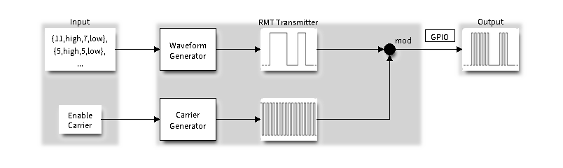
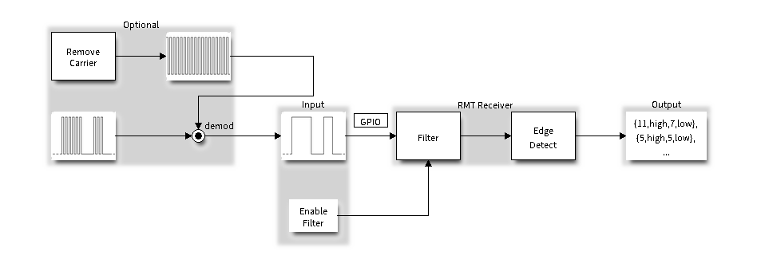

# led_strip

演示如何利用官方的 led_strip 来驱动 WS2812 灯带。要使用该库，需要在项目根目录下的 `CMakeList.txt` 文件中添加：

```c
set(EXTRA_COMPONENT_DIRS $ENV{IDF_PATH}/examples/common_components/led_strip)
```

或建立一个 components，并将 `$ENV{IDF_PATH}/examples/common_components/led_strip` 中的 `.h`、`.c` 文件复制进去。

## API 解释

led_strip 库利用了 [Remote Control Transceiver (RMT)](https://docs.espressif.com/projects/esp-idf/zh_CN/latest/esp32c3/api-reference/peripherals/rmt.html)，也就是红外遥控收发器。

该库定义了 `led_strip_config_t` 结构体用于存储最大灯珠数、RMT通道、gpio口：

```c
typedef struct {
    uint32_t max_leds;   /*!< Maximum LEDs in a single strip */
    led_strip_dev_t dev; /*!< LED strip device (e.g. RMT channel, PWM channel, etc) */
} led_strip_config_t;
```

利用 `led_strip_init` 函数可以初始化 `led_strip_config_t`：

```c
led_strip_t * led_strip_init(uint8_t channel, uint8_t gpio, uint16_t led_num);
```

此外，该库还定义了 led_strip_s 结构体，用于控制灯带，该结构体内含如下函数：

```c
/**
 * 设置特定灯珠的 RGB 
 * strip: LED灯珠，即上面的结构体
 * index: 灯珠编号
 * red、green、blue：灯珠亮度，WS2812 能接受的最大亮度为 255
*/
esp_err_t (*set_pixel)(led_strip_t *strip, uint32_t index, uint32_t red, uint32_t green, uint32_t blue);
```

```c
/**
 * 设置好RGB后，调用该函数刷新灯珠
 * timeout_ms: timeout value for refreshing task
*/
esp_err_t (*refresh)(led_strip_t *strip, uint32_t timeout_ms);
```

```c
/**
 * 关闭所用灯珠
 * timeout_ms: timeout value for clearing task
*/
esp_err_t (*clear)(led_strip_t *strip, uint32_t timeout_ms);
```

```c
/**
 * 释放资源
*/
esp_err_t (*del)(led_strip_t *strip);
```

## 原理分析

下面分析 `led_strip_rmt_ws2812.c`，主要是分析 [Remote Control Transceiver (RMT)](https://docs.espressif.com/projects/esp-idf/zh_CN/latest/esp32c3/api-reference/peripherals/rmt.html) 的使用方法。

首先需要引入 `driver/rmt.h`。

RMT 定义了名为 RMT symbols 的数据格式，每个 symbol 由两部分组成：15bits 的时长和 1bit 的电平（高或低），为了高效利用存储，实际是将两个 symbol 存储于一个 32bits 的 `rmt_item32_t` 中。


根据 RMT symbols 生成信号波形，然后加到载波上，得到最终 GPIO 上的输出。



接受过程则与上述过程相反。



使用 RMT 前，需要定义一个 `rmt_config_t` 结构体用于设置驱动，该结构体包括：

- channel：从 `rmt_channel_t` 枚举中选一个
- operation mode：发射还是接收
- pin number：用于发射或接受的 gpio
- memory blocks：该通道所需的存储数量
- 各种可用 flag 设置的参数，比如
  - When `RMT_CHANNEL_FLAGS_AWARE_DFS` is set, RMT channel will take REF_TICK or XTAL as source clock. The benefit is, RMT channel can continue work even when APB clock is changing. See power_management for more information.
  - When `RMT_CHANNEL_FLAGS_INVERT_SIG` is set, the driver will invert the RMT signal sending to or receiving from the channel. It just works like an external inverter connected to the GPIO of certain RMT channel.
- clock divider：单个脉冲的长度，值在 [1..255] 之间。RMT 的默认时钟为 APB 时钟，默认 80Mhz，但可以通过改变上面提到的 `RMT_CHANNEL_FLAGS_AWARE_DFS` 来选择 REF_TICK 或 XTAL
- 根据发射或接受模式，有特定的一些参数

如果只是需要默认参数，则可以调用 `RMT_DEFAULT_CONFIG_TX(gpio, channel)` 或 `RMT_DEFAULT_CONFIG_RX(gpio, channel)` 来返回一个 `rmt_config_t`

将 `rmt_config_t` 传入 `rmt_config()` 来使配置生效。最后还需要调用 `rmt_driver_install()` 来配置 buffer 和 ISR handler（中断服务），这样就能收发信号了。

RMT 配置好后就需要配置 WS2812，驱动中定义了 `ws2812_t` 结构体：

```c
typedef struct {
    led_strip_t parent; //前面说的一些 api 函数接口
    rmt_channel_t rmt_channel; // rmt 通道
    uint32_t strip_len; // 灯带长度
    uint8_t buffer[0]; //RGB 信息（这个是数组头）
} ws2812_t;
```

配置这个结构体的过程如下：

1. 为该结构体分配空间
2. 根据 RMT 的载波频率和 WS2812 的数据定义，设置 t0h、t0l、t1h、t1l 对应的 tick 数（用于设置 ws2812_rmt_adapter 和 ws2812 对应的函数，即下面 3 和 4）
3. 用 ws2812_rmt_adapter 初始化 rmt translator（用于将 RGB 数据转化为信号）
4. 绑定 api 函数到 ws2812 对应的函数

最后返回 api（即 parent 字段）给用户调用。由于只返回了 api，所以要释放这部分空间的话，必须使用 api 中的 `del`

下面说说 `ws2812_rmt_adapter` 和 api 是怎么实现的。其实 `ws2812_rmt_adapter` 也很简单，先是定义了 bit1 和 bit0 对应的 RMT 数据格式，然后从 MSB 开始将 RGB 每一 bit 转化为 RMT 对应的数据

`set_pixel` 也很简单，就是将 RGB 三个数据放到数组的对应位置。

`refresh` 就是调用 `rmt_write_sample` 发送数据，然后用 `rmt_wait_tx_done` 等待返回传输结果（api 参数中的 timeout_ms 就是用于此）

`clear` 就是将所有 RGB 数据置 0.